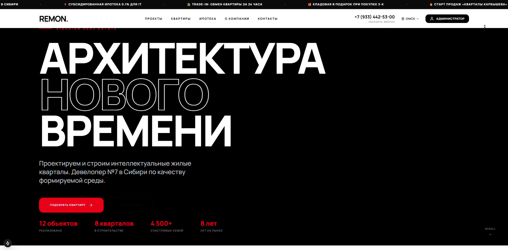
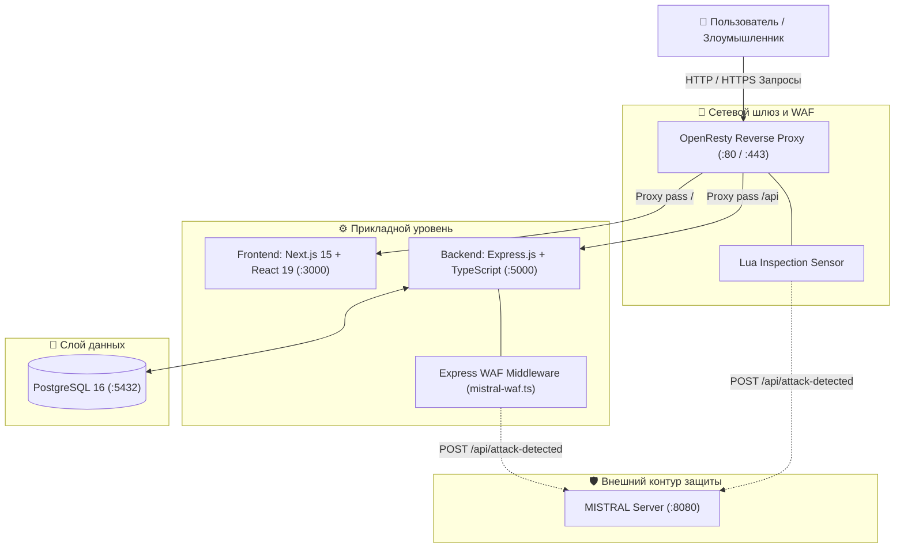

# 🏢 REMON Developer Platform & Cyber Range Testbed

<div align="center">


[](https://github.com/yousioks/remon/actions/workflows/security.yml)

**Полнофункциональный веб-портал строительно-девелоперской компании и личный кабинет жильцов, интегрированный с полигоном тестирования кибератак (Cyber Range) и сенсорами MISTRAL WAF.**

[Обзор](#-обзор) • [Архитектура](#-архитектура-стенда) • [Полигон уязвимостей (Writeups)](#-полигон-уязвимостей-security-showcase) • [Интеграция с MISTRAL SOC](#-интеграция-с-mistral-soc) • [Быстрый старт](#-быстрый-старт) • [Структура](#-структура-проекта)

</div>

---

## 📌 Обзор

**REMON** — это современное полнофункциональное веб-приложение, сочетающее в себе:
1. **Продуктовую платформу застройщика и управляющей компании**: каталог квартир и коммерческой недвижимости, личный кабинет собственника, онлайн-оплату коммунальных услуг (ЖКХ), систему подачи заявок и администрирование глобального контента.
2. **Кибер-полигон (Vulnerable Testbed)**: в приложение намеренно интегрированы контролируемые уязвимости различного уровня критичности (от IDOR до критического Remote Code Execution через OS Command Injection) для практической демонстрации и тестирования систем активного противодействия киберугрозам (**MISTRAL SOC / SOAR**).

---

## 📸 Интерфейс платформы (Screenshot)

<div align="center">

### 🏢 Веб-портал застройщика (Next.js 15 + React 19)
*Главная страница девелоперского портала с каталогом объектов, калькулятором ипотеки и интеграцией с WAF:*



</div>

---

## 🏗️ Архитектура стенда

Комплекс упакован в микросервисную архитектуру и оркеструется через Docker:



---

## 💥 Полигон уязвимостей (Security Showcase)

Стенд содержит репрезентативные сценарии атак согласно классификациям **OWASP Top 10** и **CWE**:

### 1. 🚨 Критическая уязвимость: OS Command Injection (CWE-78, CVSS 9.8)
- **Эндпоинт**: `POST /api/admin/debug/system-status`
- **Суть проблемы**: эндпоинт принимает системную команду `tool` (из белого списка: `df`, `free`, `uptime`, `top`) и пользовательский аргумент `options`. Из-за отсутствия экранирования параметра `options` перед передачей в системную функцию `child_process.exec()`, метасимволы shell (`;`, `&&`, `|`) позволяют злоумышленнику выполнить произвольный код на сервере.
- **Вектор эксплуатации**:
  ```bash
  curl -X POST http://localhost:5000/api/admin/debug/system-status \
    -H "Content-Type: application/json" \
    -d '{"tool": "df", "options": "; cat /etc/passwd"}'
  ```
- **Подробный разбор**: см. полный файл отчёта [`security/writeup.md`](security/writeup.md).

### 2. 💉 SQL Injection (CWE-89)
- **Локация**: формы авторизации и динамическая фильтрация объектов недвижимости.
- **Риск**: обход проверки пароля (`' OR '1'='1`) и несанкционированное извлечение учетных записей жильцов из базы данных.

### 3. 🔍 IDOR — Небезопасные прямые ссылки на объекты (CWE-639)
- **Локация**: личный кабинет жильца (`/api/users/:id/payments`).
- **Риск**: манипуляция идентификатором пользователя в URI позволяет просматривать квитанции, начисления и персональные данные других жильцов дома.

### 4. 💰 Мишень для Ransomware (Tampering)
- **Локация**: эндпоинт совершения платежей `/api/payments`.
- **Риск**: симуляция подмены реквизитов платежей или шифрования финансовых транзакций при тестировании SOAR-реагирования.

---

## 🛡️ Интеграция с MISTRAL SOC

Стенд REMON оснащен двухуровневой системой обнаружения угроз:

1. **Модуль WAF на бэкенде (`backend/src/middleware/mistral-waf.ts`)**:
   - Анализирует входящие URL-параметры, заголовки и тело запросов (JSON/form-data) на наличие подозрительных паттернов.
   - Детектирует SQL-инъекции, XSS, Path Traversal, Command Injection, попытки брутфорса и подмены ролей.
   - При срабатывании формирует алерт с IP-адресом атакующего, вектором атаки и payload, немедленно пересылая его на сервер `MISTRAL Server` по маршруту `/api/attack-detected`.
2. **OpenResty Lua WAF (`nginx/nginx.conf`)**:
   - Фильтрует сетевой трафик на уровне прокси-сервера до попадания в приложение Node.js.
   - Обеспечивает первичное отсечение вредоносного трафика и мгновенную синхронизацию с правилами брандмауэра.
3. **Автоматический бан (SOAR Response)**:
   - При получении критического инцидента от REMON сервер MISTRAL автоматически применяет правило блокировки брандмауэра (`ufw deny from <ATTACKER_IP>`), полностью изолируя атакующего в течение нескольких миллисекунд.

---

## 📁 Структура проекта

```text
Remon/
├── backend/                    # REST API бэкенд на Express.js + TypeScript
│   ├── src/
│   │   ├── index.ts            # Точка входа сервера API (порт 5000)
│   │   ├── db.ts               # Пул соединений PostgreSQL (pg)
│   │   ├── middleware/
│   │   │   ├── auth.ts         # JWT-проверка авторизации и ролей
│   │   │   └── mistral-waf.ts  # WAF-сенсор для детекции атак и связи с SOC
│   │   ├── routes/
│   │   │   ├── auth.ts         # Авторизация и регистрация
│   │   │   ├── users.ts        # Профили пользователей и жильцов
│   │   │   ├── payments.ts     # Платежи за ЖКХ и история начислений
│   │   │   ├── admin.ts        # Админ-панель управления ресурсами
│   │   │   ├── settings.ts     # Настройки глобального медиа-баннера
│   │   │   └── debug.ts        # [VULNERABLE] Эндпоинт Command Injection
│   │   └── utils/
│   │       └── sanitize.ts     # Санитизация ввода через DOMPurify
│   └── package.json
│
├── frontend/                   # Клиентский интерфейс на Next.js 15
│   ├── src/
│   │   ├── app/                # Next.js App Router (страницы портала)
│   │   │   ├── page.tsx        # Главная страница застройщика
│   │   │   ├── dashboard/      # Личный кабинет собственника
│   │   │   ├── payments/       # Страница оплаты квитанций ЖКХ
│   │   │   └── admin/          # Панель управления и загрузка баннеров
│   │   └── components/
│   │       └── GlobalMediaBanner.tsx # Компонент динамического медиа-баннера
│   └── package.json
│
├── nginx/                      # Контур WAF на OpenResty
│   ├── Dockerfile              # Сборка образа с Lua-модулями
│   └── nginx.conf              # Сигнатуры фильтрации HTTP-запросов
│
├── security/                   # Документация по безопасности
│   └── writeup.md              # Подробный технический райтап уязвимости CWE-78
│
├── docker-compose.yml          # Оркестрация для локальной разработки
├── docker-compose.prod.yml     # Продакшн-оркестрация с оптимизацией
├── init.sql                    # Схема СУБД PostgreSQL и демо-данные жильцов
├── reset-db.sh                 # Скрипт мгновенного сброса БД к исходному состоянию
└── deploy.sh                   # Скрипт автоматизированного развертывания
```

---

## 🚀 Быстрый старт

### Вариант 1. Запуск через Docker Compose (Рекомендуемый)

Разворачивает всю экосистему (Next.js, Express API, PostgreSQL, OpenResty) одной командой:

```bash
# Клонирование репозитория
git clone https://github.com/yousioks/remon.git
cd remon

# Создание файла окружения
cp .env.example .env

# Запуск контейнеров
docker compose up -d --build
```

После старта будут доступны:
- 🌐 **Frontend (Next.js)**: [http://localhost:3000](http://localhost:3000)
- ⚙️ **Backend API**: [http://localhost:5000](http://localhost:5000)
- 🚪 **WAF Gateway**: [http://localhost:80](http://localhost:80)

### Вариант 2. Локальный запуск без Docker

**1. Запуск бэкенда:**
```bash
cd backend
npm install
npm run dev
```

**2. Запуск фронтенда:**
```bash
cd ../frontend
npm install
npm run dev
```

### Сброс базы данных к исходному состоянию
Для повторной демонстрации атак или сброса тестовых данных используйте скрипт:
```bash
chmod +x reset-db.sh
./reset-db.sh
```

---

## 📄 Лицензия

Проект разработан в рамках квалификационной работы для демонстрации современных методов защиты веб-приложений.
Распространяется под лицензией [MIT](LICENSE).
